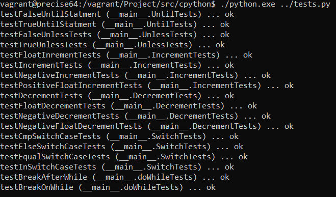

Group 5 Final Project
=========================================
**Team Name:**  Group 5 
**Team Members:** Pedro Oliveira, Zak Ahmed, Piranaven Selva

## What is it? 
This is the final project for the course COMP SCI 4TB3 - Syntax Based Tools and Compilers. Group 5, comprised of Pedro, Piranaven & Zak will work together to enhance Python.
Python is one of the most beloved programming languages. It contains a plethora of syntax & semantics that enables its users to achieve their goals. However, it does not 
contain a handful of syntax that we believe would enrich the programming language and provide developers with more flexibility. These language constructs are Increment,
Decrement, Until Loops, Unless, Do-While Loops, & Switch-Case Statements. These enhancements, although not necessarily pythonic, would undoubtedly strengthen a developers toolkit!

-------------------------------------------------
### How to Run?
-------------------------------------------------

## Setup Requirements 
(Would recommend running on VM or AWS instance)
- Ensure you have gcc installed
- Ensure you are able to call the commands make, configure, git
- Clone the repo

## Run Instructions
- Navigate to the directory src/cpython
- run `bash ./configure` (This will create your Makefile)
- run `make`( An executable will be created)
- run `./python <LOCATION OF TEST>` (i.e: `/group-05-final-project/src/test/testSet.py`)
 
VOILA! Your output should look like below! : 

-------------------------------------------------
### Summary of File's Modified 
-------------------------------------------------

Additions:
- src/test/testSet.py

Modifications to src/cPython:

- Grammar/Grammar
- Python/ast.c
- Python/symtable.c 
- Python/compile.c
- Ptyhon/ceval.c
- Parser/Python.asdl
- Parser/tokenizer.c
- Include/token.h
- Lib/lib2to3/tests/data/py3_test_grammar.py

Additional modifications in IncrDecrExpr branc
- Lib/opcode.py
- Include/opcode.h
- Include/abstract.h
- Include/object.h
- Objects/abstract.c
- Modules/_collectionsmodule.c
- Modules/_ctypes/_ctypes.c
- Modules/_datetimemodule.c
- Modules/_decimal/_decimal.c
- Modules/_testcapimodule.c
- Objects/boolobject.c
- Objects/complexobject.c
- Objects/dictobject.c
- Objects/floatobject.c
- Objects/longobject.c
- Objects/object.c
- Objects/setobject.c
- Objects/typeobject.c
- Objects/weakrefobject.c
- PC/winreg.c
- Python/ast_opt.c

Auto-Generated Files we had to verify:

- Include/graminit.h
- Include/Python-ast.h
- Python/Python-ast.c
- Python/graminit.c

-------------------------------------------------
### Summary of Folder Structure and File Contents 
-------------------------------------------------

**Doc**  
Documentation for the project
- Development Plan
- Poster

**Resources** 
  - Research Material used as foundations for the project

**src**
- cpython
- test
  

LICENSE
  - License information
  
README.md
  - This file
